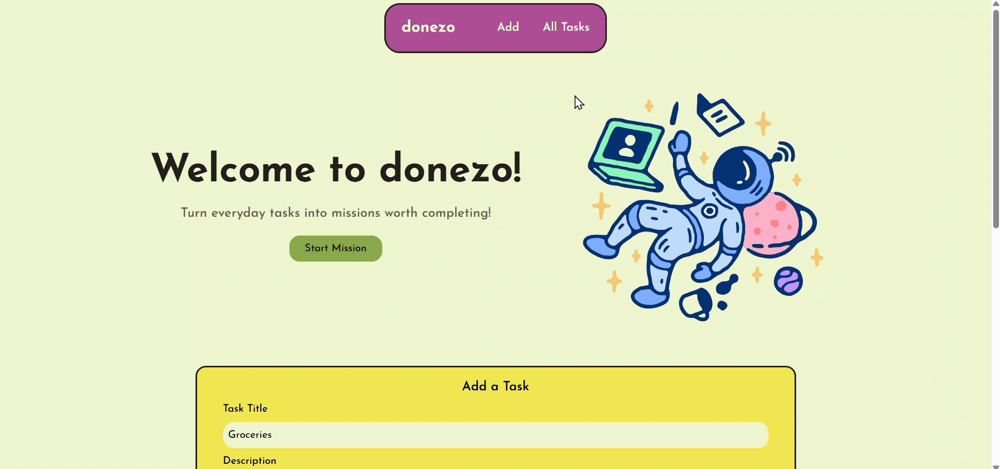

# Donezo Task Management Tool

#### Helping users turn tasks into successful missions using React, TypeScript, and TailwindCSS

## Description
Donezo is a mission-themed task manager designed to motivate users to complete daily goals. Users can create tasks with descriptions, designate priority status for tasks, update and delete tasks, and search and filter tasks by title, description, and completion status.

This app leverages React and TypeScript for dynamic state management and TailwindCSS for styling. This project was developed as part of an assignment for Per Scholas Full Stack Engineering Bootcamp.

Visit the live site: https://donezo-app.netlify.app/

## Table of Contents
* [Tech Stack](#techstack)
* [Features](#features)
* [Design Process](#design)
* [Project Reflections](#reflections)
    * [Implementing TypeScript](#implement)
    * [Component Composition](#components)
    * [Challenges](#challenges)
* [Deployment](#deployment)
* [Resources](#resources)
* [About the Author](#author)

## Tech Stack
### Languages
* TypeScript
* JavaScript
* CSS3
### Libraries
* React
* Tailwind CSS

### Build Tools
* Vite
* Netlify

### State Management / Persistence
* React useState, useEffect
* Local Storage 

## Features
Users can:
1. Create new tasks, with a description, due date, and priority status
2. Update task completion status
3. Delete tasks
4. Filter tasks by status
5. Search tasks by title or description
6. Persists tasks to local storage
7. Smooth scrolling for navigation links

### Future Iterations
Planned features include:
* Dashboard with dynamic progress overview, task stats and completion percentages
* Faded styling for completed tasks
* Priority-based sorting option in main task view
* Daily streaks for tasks completed within a 24-hour period
* Multi-state streak component views to prompt users to maintain momentum

## Design Process
Donezo was designed with the goal of motivating users who struggle with daily productivity, turning tasks into fun missions. The design focused on the end-user experience and evolved throughout the development process, adjusting to MVP scope changes.

### Key Steps:
* **User Goals**: Mapped target users, their challenges, and goals, creating a solution to gamify task management.
* **Dashboard Components**: Designed task statistic components with motivational copy and empty state versions to guide future iterations.
* **Visual Branding**: Selected a playful color palette and font and implemented style variables in Figma for consistency.
* **Wireframes**: Built high-fidelity wireframes, considering various states.
* **Iteration**: Updated the hero section and UX copy to align with the product vision, including an empty state hero section for new users.

### Tools used
* Figma, SVG converter plugin
* Coolors

### Font used
* [Josefin Sans](https://fonts.google.com/specimen/Josefin+Sans) 

### Assets used
* [StoryTale Thursday Pack](https://storytale.io/pack/294)

<iframe style="border: 1px solid rgba(0, 0, 0, 0.1);" width="800" height="450" src="https://embed.figma.com/design/SqfXpZNaWTyG7iycnPyG1N/SBA-9---Task-Manager-Dashboard?node-id=0-1&embed-host=share" allowfullscreen></iframe>

## Project Reflections
### Implementing TypeScript
Type safety was a core aspect of this project to ensure consistent and efficient handling of data flowing through the app's components. I implemented various TypeScript features including well defined types and prop interfaces to guide the app's functionality especially at the start of the project.

* Started with creating interface for the Task data and defining props for various components in `index.ts`. Before integrating the full functionality, I used dummy data to verify the flow of information was correct and mapped the data into a simple div in my `TaskList` component
* Used nested prop destructuring in my components that needed the `Task` interface so I could directly pull the fields in my code instead of using dot notation
* Defined union types for task priority and completion statuses for use in props for all components
* Included callback functions and defined them in my types with the expected data type for function parameters
* Implemented `as` keyword when passing arguments to callback functions to ensure enhanced type safety and reduce errors

### Component Composition
I planned out the components I would use and started my dev process by using dummy data to first test the flow of data between components. This method proved helpful in ensuring that callback functions were working properly before adding full functionality. I learned how to integrate local storage in a React app.

* Created components for task form, search bar and filter, list of tasks, and individual task items
* Added temporary dummy callback functions with console log statements to verify the flow of data was working across components before full functionality
* Managed state locally to implement controlled form inputs, radio buttons, and select elements using React documentation
* Lifted up search and filter states to the Dashboard to be passed to the `TaskList` child component and created callback functions to maintain controlled input and select elements in `SearchBar` component
* Used useEffect for dynamic display of search and filter results and updated tasks, writing logic and passing the filteredTasks into the taskList component
* Implemented local storage utility functions and used a function initializer for `tasks` state to retrieve local storage data or default to an empty array to display in the task list on the first render
* Used useEffect side effect to store any task updates to local storage to ensure data persistence without triggering extra renders
* Once the key functionality was completed, I made adjustments to the UI using TailwindCSS, adding a hero section and nav bar with smooth scrolling. This included going back into Figma and reworking the design to fit MVP scope changes

### Challenges
Some of the challenges I faced during this project involved troubleshooting TypeScript issues and React behavior. I sought out resources in the React documentation, various blogs, and through build error logs in Netlify for further understanding of primarily TypeScript errors.

* **Local storage initialization**: When setting up local storage, I initially thought to use a useEffect to set the state with what was retrieved. React warned about using setter functions in a side effect as it could slow down render. Even though my intended useEffect would have an empty dependency array and only run on the first render, I researched alternatives and found a guide to initializing state with a function while using local storage. I moved local storage functions to a `localStorageUtils.ts` file to simplify my state initializer. I set it to return either retrieved data from local storage or null. In the return statement for the initializer function, I put a conditional so that it sets data from localStorage or an empty array.
* **Using state across multiple components**: I learned how to make a select element a controlled element in the `SearchBar` component. I initially managed state variables for both the search and filter in the component, but realized I needed to somehow track these states and use them to render the correct tasks in the `TaskList` component. I learned about lifting state up in the React docs and decided to use callback functions to send the user's choices and input to the parent. Instead of using the `tasks` state array as a prop to the list component, I created another state variable with `filteredTasks` to pass down. I debated using state or a normal variable for the `selectedFilter` state, but chose to go with state to set the filter as a dependency in the useEffect to reflect updates to both tasks and filtered tasks.
* **Filter logic with 'All' option**: One mistake I made was because I added a new union type for the filters which included All, at one point I could not see any of my tasks. I realized the issue was that i set my logic to check that `task.status === searchFilter`. This was a mistake as the union type for `TaskFilters` included 'All', which doesn't exist as an actual completion type in each Task object. To solve it, I had to add an additional `OR` condition when the selectedFilter is 'All' OR when the `task.status === selectedFilter`. This made sure that everything showed when there wasn't a specific filter selected. I also used an `&&` operator to make sure that both search term and filter would work simultaneously.
* **Dynamic styling based on priority**: Initially I tried to use the priority classes style object in my `TaskItem` directly in the className for the `p` tag on the item which held the task's priority status. There were many type errors when trying to use the object directly with dot notation and a ternary. I then decided to create a priorityClass variable set to a string, used switch statements giving a value to this variable, and used it to inject into the className for proper styling. This was a cleaner way to get the styling dynamic.

## Deployment
This app is hosted on Netlify
[Live Site](https://donezo-app.netlify.app/)

### Instructions to run the project locally:

1. Clone the repository
2. Run `npm install` to retrieve dev dependencies
3. Run `npm run dev` to open the server
4. Test the interactions, add tasks, update statuses, search by title or description and filter by completion status.

## Resources Used
For implementing local storage
https://medium.com/@roman_j/mastering-state-persistence-with-local-storage-in-react-a-complete-guide-1cf3f56ab15c

For ensuring type safety for callback function arguments with as keyword
https://dev.to/starneit/understanding-typescript-as-keyword-2ne4

For creating controlled components and updating arrays with state
https://react.dev/reference/react-dom/components/select
https://react.dev/learn/updating-arrays-in-state

For lifting state up and sharing it between search and task list components
https://react.dev/learn/sharing-state-between-components

## About The Author
Hi, I'm Magali. I'm a design-minded engineer with strengths in front-end development, accessibility, and UX design. I'm a full stack engineering student at Per Scholas. I enjoy building products with accessibility in mind so that everyone can have access to information. This project allowed me to reinforce skills with React, state management, and styling with Tailwind CSS.

